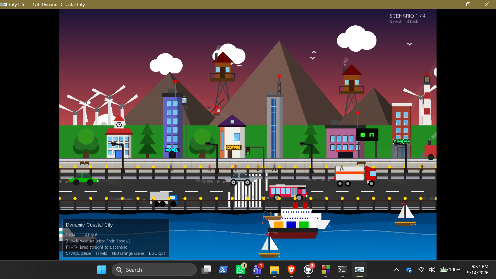
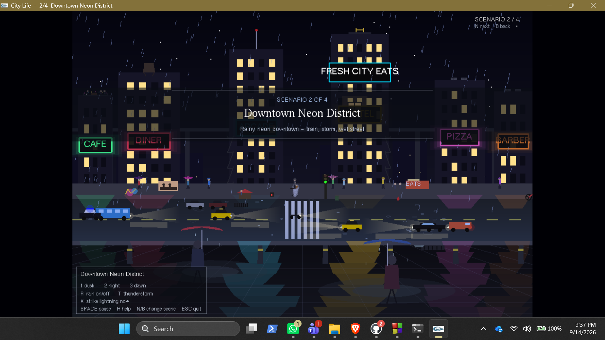
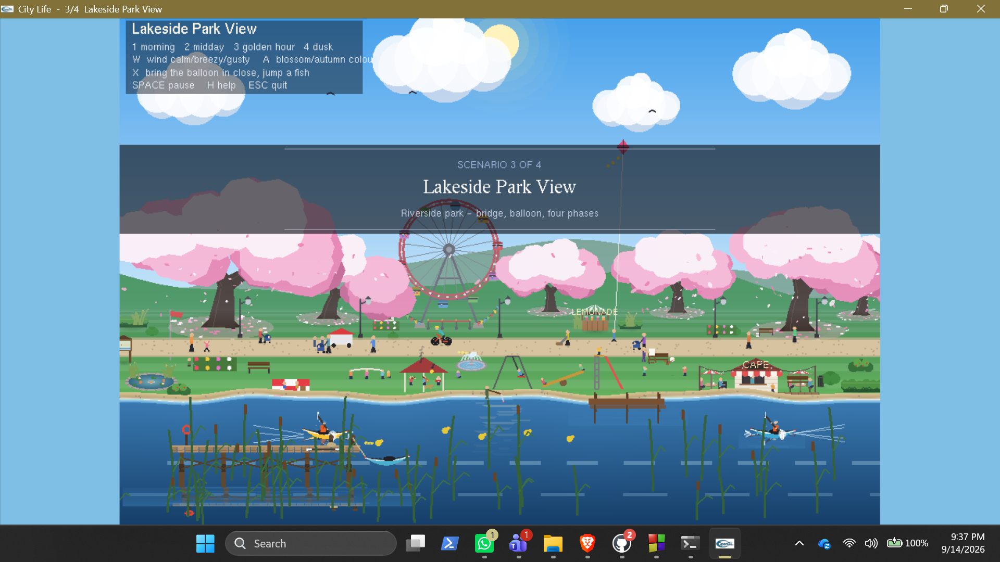

# CityLife: Dynamic Coastal City and Urban Scenes in OpenGL

A multi-scenario 2D urban simulation written in C++ with OpenGL and GLUT. CityLife renders four animated city environments in a single application, using only immediate-mode OpenGL primitives: no textures, no model files, no shaders and no external assets.

> Computer Graphics final project (Group F). The full write-up is in [`docs/CityLife_Project_Report.pdf`](docs/CityLife_Project_Report.pdf).

## Scenarios

| # | Scenario | Highlights |
|---|----------|------------|
| 1 | **Dynamic Coastal City** | Full day-night cycle with sun, moon and stars; rain, snow and lightning; cruise ship, yacht and fishing boats; helicopter patrol; lighthouse beacon; traffic with braking and exhaust; pedestrians on crosswalks; seagulls; glass elevator |
| 2 | **Downtown Neon District** | Rain-soaked night street with pulsating neon signs; elevated commuter train; wet-road reflections and puddle glow; police car with flashing lights; food truck with steam; street performer; cyclists; foreground silhouette walkers |
| 3 | **Lakeside Park** | Cherry-blossom trees with falling petals; Ferris wheel; hot-air balloon; kayakers; ducks, geese, squirrels and butterflies; playground, bandstand, café terrace and fairground; four times of day |
| 4 | **Riverfront Winter Market** | Snowy plaza with Christmas tree and ice rink; market stalls with steam; fire pit with embers; clock tower with swinging pendulum; fireworks; aurora borealis; frozen canal with boats; winter-to-autumn season switch |

## Spotlight: Scenario 4, Riverfront Marketlife

The final scene is a snowy riverside night market that can shift from winter to autumn and from night to day. Everything is drawn from code, with no image assets.

**My contribution (Shahriyar Lipu):** I designed and implemented Scenario 4 from scratch, everything inside the `Scenario4` namespace: the scene layout (planned on a coordinate grid in GeoGebra), all drawing routines, the animation and particle systems (snow, embers, fireworks, aurora), the day-night and winter-autumn transitions, and the keyboard and mouse controls. I also partially contributed to integrating and merging the four scenarios into the complete CityLife project and helped ensure that the final project remains runnable across Windows, macOS and Linux through the platform-specific OpenGL/GLUT build configurations. It is also available as a standalone program in [`src/RiverFrontMarketLife.cpp`](src/RiverFrontMarketLife.cpp), so it can be built and run on its own without the other three scenarios.

**What's in the scene**

- **Sky:** moon, twinkling stars with bright cross-shaped flares, flying birds, Santa's sleigh, and an aurora borealis built from sinusoidal colour bands.
- **Market:** shop facades with lit windows and signs, market stalls with goods and awnings, a tea stall with seated customers and steam, a decorated Christmas tree, snowmen, Santa, carolers and queues of customers.
- **Plaza life:** an ice-skating rink with skaters, a fire pit with ember particles, a Ferris wheel with coloured cabins, and a clock tower with a swinging pendulum.
- **Street and river:** a converging-perspective road with cars, bikes, a rickshaw and lamp posts; a river with boats and a frozen canal, with reflections.
- **Weather and effects:** a three-layer snow system (far, mid and near bands with size scaling and wind drift, up to 1,500 particles), fog, fireworks with ground flash, and a smooth winter-to-autumn season transition.

**Controls**

| Key / mouse | Action |
|-------------|--------|
| `1` `2` `3` | Light / medium / heavy snow |
| `4` / `5` | Daytime / night |
| `S` | Switch winter ↔ autumn (the season is kept when you change time of day) |
| `L` | Warm / multicolour lights |
| `F` | Snow squall |
| `X` | Trigger the sled, fireworks and aurora immediately (they are rare by design) |
| Left / right click | Resume / pause animation |

## Technical highlights

- **Namespace-per-scenario architecture.** Each scene's state, structs, drawing functions and timers live in their own namespace (`Scenario1_CoastalCity`, `Scenario2`, `Scenario3`, `Scenario4`). Four people could work independently in one translation unit, while a shared top-level layer handles navigation, pausing and the HUD.
- **Depth-scaled perspective.** `DepthScale` maps a figure's Y position to a scale multiplier (about 0.62 at the horizon to 1.36 in the foreground), giving a sense of depth on a flat 2D canvas.
- **Water reflections.** `BeginReflection` / `EndReflection` mirror geometry with a negative Y scale. The result is washed with the water colour and overlaid with procedural ripple bands.
- **Day-night and weather systems.** Colour interpolation across sky presets, particle-based rain and snow, branching lightning, fog layers and storm-driven sky tinting.
- **Particle effects.** Exhaust smoke, steam, embers, fireworks, falling petals and leaves.
- **Self-contained rendering architecture.** The complete CityLife application is contained in `project.cpp`, with the standalone Scenario 4 implementation provided separately in `RiverFrontMarketLife.cpp`. The full application is timer-driven at about 40 FPS and uses a letterboxed viewport that keeps the 3:2 world shape at any window size.

## Controls

**Global (all scenarios)**

| Key | Action |
|-----|--------|
| `N` / `B` | Next / previous scenario |
| `F1`–`F4` | Jump straight to a scenario |
| `H` | Toggle help overlay |
| `Space` | Pause / resume |
| `Esc` | Quit |

**Per scenario**

| Scenario | Keys |
|----------|------|
| 1. Coastal City | `1` day · `2` night · `3` cycle weather (clear / rain / snow) |
| 2. Neon District | `1` dusk · `2` night · `3` dawn · `R` rain on/off · `T` thunderstorm · `X` strike lightning |
| 3. Lakeside Park | `1`–`4` morning / midday / golden hour / dusk · `W` wind (calm / breezy / gusty) · `A` blossom / autumn colour · `X` bring the balloon close and make a fish jump |
| 4. Winter Market | `1`–`3` snow amount · `4` daytime · `5` night · `S` winter / autumn · `L` warm / multicolour lights · `F` snow squall · `X` set off the sled, fireworks and aurora |

## Build and run

CityLife needs a C++11 compiler plus OpenGL and GLUT.

### Windows (MinGW-w64 / GCC)

Install [FreeGLUT](https://freeglut.sourceforge.net/) for MinGW, then:

```bash
g++ -std=gnu++11 src/project.cpp -o CityLife -lfreeglut -lopengl32 -lglu32
./CityLife
```

To build only Scenario 4, use the same command with `src/RiverFrontMarketLife.cpp` and an output name such as `RiverFrontMarket`.

`gnu++11` is preferred over `c++11` on MinGW because strict ISO mode hides some C runtime declarations that the MinGW headers need.

**Code::Blocks:** enable *"Have g++ follow the C++11 ISO C++ language standard"* under *Settings → Compiler → Global compiler settings → GNU GCC Compiler → Compiler settings*, then use **Build → Rebuild** (a plain Build reuses stale object files). Link against `freeglut`, `opengl32` and `glu32`.

### macOS

OpenGL and GLUT ship with macOS; you only need the Xcode command line tools (`xcode-select --install`).

```bash
g++ -std=c++11 src/project.cpp -o CityLife -framework OpenGL -framework GLUT
./CityLife
```

Apple marks OpenGL and GLUT as deprecated. The source defines `GL_SILENCE_DEPRECATION`, so the compiler warnings are suppressed; the program still runs.

### Linux

```bash
sudo apt install freeglut3-dev      # Debian / Ubuntu
g++ -std=c++11 src/project.cpp -o CityLife -lGL -lGLU -lglut
./CityLife
```

> **Platform note:** The project was developed and tested on Windows with MinGW GCC and Code::Blocks. macOS and Linux are supported through conditional `#include` blocks at the top of the source files (no other code differs per platform).

### Common build error

A wall of errors such as `'constexpr' does not name a type`, `'nullptr' was not declared` or `'MAX_DROPS' was not declared` is not a bug in the code. It means the C++11 flag is off; enable it as described above.

## Repository layout

```
.
├── README.md
├── src/
│   ├── project.cpp             # full CityLife project: all four scenarios
│   └── RiverFrontMarketLife.cpp # Scenario 4 (Riverfront Winter Market) on its own
└── docs/
    ├── CityLife_Project_Report.pdf
    └── screenshots/            # images from the report
```

## Team

| Member | Scenario |
|--------|----------|
| Sabit Hassan | Scenario 1: Dynamic Coastal City |
| Mehedi Hassan | Scenario 2: Downtown Neon District |
| Ashab Mahmud Tousif | Scenario 3: Lakeside Park |
| Shahriyar Lipu | Scenario 4: Riverfront Winter Market (also standalone in `RiverFrontMarketLife.cpp`) |

Each member designed, coded and animated a complete, standalone scenario; contribution was split equally (25% each).

## Known limitations

- Rendering is single-threaded immediate-mode OpenGL 1.x, so frame rate can drop on older hardware when Scenario 4's snow, fireworks and aurora run together.
- Everything is drawn from geometric primitives, so there are no textured surfaces.
- Some bitmap-text and HUD positioning assumes the default 1200×800 window; extreme aspect ratios may misalign text slightly.
- There is no audio.

## Future work

Texture and sprite integration, a shader-based OpenGL 3.3+ pipeline, audio (ambient sound and effects), procedural city generation, mouse pan and zoom, a networked multi-viewer mode, a WebGL / OpenGL ES port, and AI-driven pedestrian behaviour.

## Acknowledgements

We would like to thank:

- **Our course instructor** for guidance, feedback and the opportunity to build this project as part of the Computer Graphics course. 
- **The OpenGL and FreeGLUT communities** for the libraries that made this project possible, and the **MinGW-w64** and **GCC** teams for the toolchain.
- **Code::Blocks** for the IDE used during development.
- **GeoGebra**, which we used to plot each scene's coordinate layout before coding it (see the graph plots in the report).
- **Sumanta Guha**, *Computer Graphics Through OpenGL: From Theory to Experiments*, our main academic reference for transformations, projection, blending and primitive assembly.
- **Shamus Young's *Pixel City*** project, whose glowing-window and neon-light techniques inspired the look of Scenario 2.
- The many authors of online OpenGL and GLUT tutorials and articles on particle effects, day-night cycles and 2D reflections that informed our approach. These are listed in the project report.
- **Friends, classmates and family** who tested the build and gave feedback.

All artwork in CityLife is drawn procedurally in code; no third-party image, audio or model assets are used.


## Screenshots

### Scenario 1: Dynamic Coastal City


### Scenario 2: Downtown Neon District


### Scenario 3: Lakeside Park


### Scenario 4: Riverfront Market Life


## License

This project is released under the [MIT License](LICENSE). Copyright (c) 2026 Shahriyar Lipu, Sabit Hassan, Mehedi Hassan, and Ashab Mahmud Tousif.
